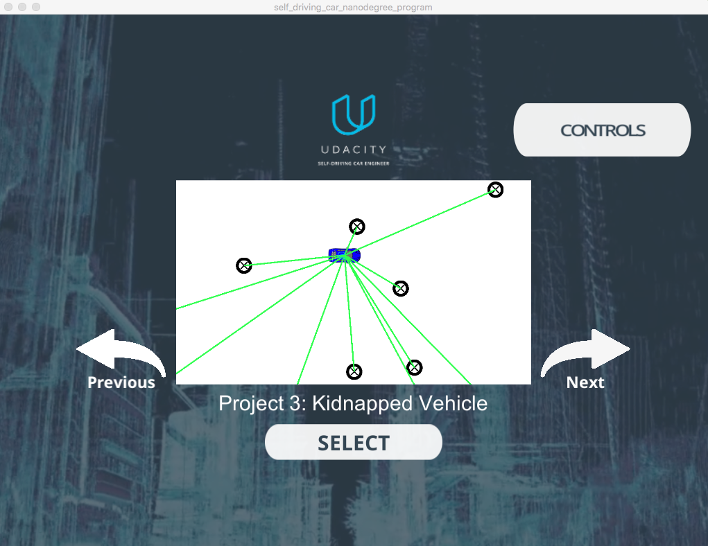

# CarND-Kidnapped-Vehicle-Particle Filter
Udacity Self-Driving Car Nanodegree - Kidnapped Vehicle project

## Project Introduction
The robot has been kidnapped and transported to a new location [Kidnapped robot(car) problem](https://en.wikipedia.org/wiki/Kidnapped_robot_problem)! Luckily it has a map of this location, a (noisy) GPS estimate of its initial location, and lots of (noisy) sensor and control data.

In this project implements  a 2 dimensional particle filter [Particle Filter](https://en.wikipedia.org/wiki/Particle_filter)  in C++. Particle filter is given a map and some initial localization information (analogous to what a GPS would provide). At each time step the filter gets observation and control data.


## Prerequisites

The project has the following dependencies (from Udacity's seed project):

- cmake >= 3.5
- make >= 4.1
- gcc/g++ >= 5.4
- Udacity's simulator.

For instructions on how to install these components on different operating systems, please, visit [Udacity's seed project](https://github.com/udacity/CarND-Kidnapped-Vehicle-Project). 


## Running the Code
This project involves the Term 2 Simulator which can be downloaded [here](https://github.com/udacity/self-driving-car-sim/releases)

This repository includes two files that can be used to set up and install uWebSocketIO for either Linux or Mac systems. For windows either Docker, VMware, or even Windows 10 Bash on Ubuntu can be used to install uWebSocketIO.

Once the install for uWebSocketIO is complete, the main program can be built and ran by doing the following from the project top directory.

1. mkdir build
2. cd build
3. cmake ..
4. make
5. ./particle_filter

Alternatively some scripts have been included to streamline this process, these can be leveraged by executing the following in the top directory of the project:

1. ./clean.sh
2. ./build.sh
3. ./run.sh


# Implementing the Particle Filter
The directory structure of this repository is as follows:

```
root
|   build.sh
|   clean.sh
|   CMakeLists.txt
|   README.md
|   run.sh
|
|___data
|   |   
|   |   map_data.txt
|   
|   
|___src
    |   helper_functions.h
    |   main.cpp
    |   map.h
    |   particle_filter.cpp
    |   particle_filter.h
```

The only file that has been modified was `particle_filter.cpp` in the `src` directory. The file contains the scaffolding of a `ParticleFilter` class and some associated methods. 

`src/main.cpp` file contains the code that is actually running particle filter and calling the associated methods.

# Code description

The Particle Filter is implemented in [src/particle_filter.cpp](./src/particle_filter.cpp):

- Initialization: Particle initialization is implemented at [ParticleFilter::init](./src/particle_filter.cpp#L24) from line 24 to line 62.

- Prediction: The prediction step is implemented at [ParticleFilter::prediction](./src/particle_filter.cpp#L64) from line 64 to line 100.

- Weight's update: This is the more important operation in my opinion. It is implemented at [ParticleFilter::updateWeights](./src/particle_filter.cpp#L138) from line 138 to line 217.

Almost the rest of the magic happens on [src/main.cpp](./src/main.cpp). The event handler declared at [line 49](./src/main.cpp#L49) parse the received message and call the above described Particle Filter methods.


## Inputs to the Particle Filter
Inputs to the particle filter can be found in the `data` directory.

#### The Map*
`map_data.txt` includes the position of landmarks (in meters) on an arbitrary Cartesian coordinate system. Each row has three columns
1. x position
2. y position
3. landmark id

### All other data the simulator provides, such as observations and controls.

> * Map data provided by 3D Mapping Solutions GmbH.


## Rubric points
[Rubric Points](https://review.udacity.com/#!/rubrics/1965/view)


Using the right arrow, you need to go to the Kidnapped Vehicle project:



Clicking on "Select," the simulator for the Kidnapped project start and the Particle Filter informs it is connected:


Clicking on "Start" button, the vehicle starts moving, and the blue circle(the filter calculated position) moves with it. After a while, the simulator informs you if your Particle Filter passed or failed. Here is an example of the filter passing the test:


